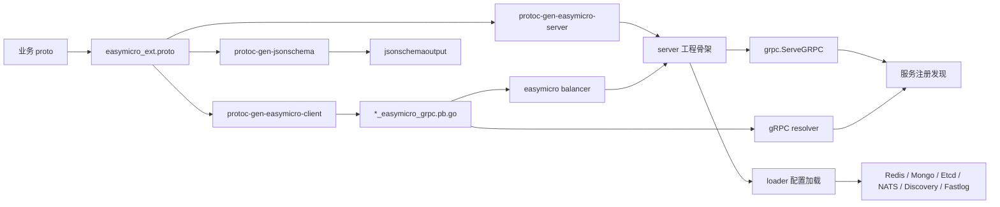

# EasyMicro 技术介绍文档

`EasyMicro` 是一个 Go 微服务开发框架，围绕 gRPC、服务发现、配置加载、代码生成、NATS 调试 RPC、Mongo/Redis/Etcd 连接初始化、选举、日志、信号和运行时监控提供一套轻量基础设施。

它不是一个强约束、厚封装的全家桶框架，而更像一组可拆卸的微服务工程组件：

- 运行时库：`grpc`、`loader`、`node`、`elect`、`nats`、`sysmon` 等。
- 代码生成器：`protoc-gen-easymicro-client`、`protoc-gen-easymicro-server`、`protoc-gen-jsonschema`。
- 协议扩展：`proto/easymicro_ext.proto`。
- 示例工程：`example/userserver`、`example/echoserver`、`example/corpserver`。
- 中间服务示例：`grpc/middleservice` 中的健康检查、作业调度等。

## 1. 设计目标

- 用 proto 驱动 gRPC 客户端和服务端骨架生成。
- 用极少模板代码生成标准微服务目录结构。
- 统一服务启动流程：加载配置、初始化连接、注册服务、启动 gRPC、处理信号。
- 统一客户端调用方式：服务发现 resolver、全局拨号选项、负载均衡器、拦截器。
- 支持开发环境下使用 NATS 模拟 gRPC 调用，便于本地调试和 fallback。
- 提供可插拔的日志、追踪、熔断、恢复和统计拦截器。
- 支持 Redis、MongoDB、Etcd、NATS、Discovery、Fastlog 等常用基础设施自动加载。
- 支持热加载配置和信号驱动的优雅停止、pprof 采样、内存打印。
- 保持实现直接、模块边界清楚，便于项目按团队需求继续演进。

## 2. 项目结构

```text
easymicro/
├── elect/                         # 主从选举封装
├── etcd/                          # Etcd client 注册和获取
├── example/                       # 示例 proto、客户端包、服务端工程
├── grpc/                          # gRPC 服务启动、resolver、balancer、错误、拦截器
├── grpc/middleservice/            # 内置中间服务示例，健康检查、作业调度
├── grpcgateway/                   # grpcgateway 初始化辅助
├── loader/                        # 本地配置加载和后端连接初始化
├── log/                           # 框架日志接口和默认 stdout logger
├── mgorm/                         # mgorm 查询日志桥接
├── nats/                          # NATS like gRPC 调用和 fallback
├── node/                          # 当前节点名称、IP、端口元信息
├── pb/                            # easymicro_ext.proto 生成代码
├── proto/                         # easymicro 自定义 proto option
├── protoc-gen/                    # protoc 插件源码
├── routeredis/                    # routeredis 日志桥接
├── sysmon/                        # 信号、pprof、内存监控
├── util/                          # AES 加解密工具
├── go.mod
└── readme.md
```

## 3. 整体架构



运行时链路可以概括为：

1. 业务通过 proto 描述服务和消息。
2. protoc 插件生成客户端调用封装和服务端骨架。
3. 服务端启动时读取 `easymicro_loader` 下的配置。
4. loader 初始化日志、Etcd、Discovery、NATS、Redis、Mongo 等基础设施。
5. `ServeGRPC` 监听本机 IP 和端口，并把节点注册到 Discovery。
6. 客户端通过生成的 `XxxGRPC()` 调用服务。
7. 客户端 resolver 从 Discovery 获取节点，并交给负载均衡器选择连接。
8. 拦截器负责 trace、日志、熔断、panic recover、NATS fallback 等横切能力。

## 4. 配置加载

配置加载代码位于 `loader/`，基于 Viper。

### 4.1 配置搜索路径

默认配置目录名：

```go
PrivateConfigBasicDirName = "easymicro_loader"
```

环境变量：

```go
EASYMICRO_CONFIG_DIR
```

搜索路径按顺序包含：

```text
./easymicro_loader/
../easymicro_loader/<nodeName>
../easymicro_loader
../../easymicro_loader/<nodeName>
../../easymicro_loader
$EASYMICRO_CONFIG_DIR/<nodeName>
$EASYMICRO_CONFIG_DIR
$HOME/easymicro_loader/<nodeName>
$HOME/easymicro_loader
/etc/easymicro       # 非 Windows
C:\easymicro         # Windows
```

`nodeName` 来自 `node.SetName()`，通常由生成的 `boot.InitNode()` 设置。

### 4.2 通用加载 API

```go
func LoadConfigToViper(configFileName string) (*viper.Viper, error)
func LoadAndWatchConfig(configFileName string, data any, dataMu sync.Locker, onWatch func(v *viper.Viper, in fsnotify.Event)) error
```

`LoadAndWatchConfig` 会：

- 首次读取并反序列化配置。
- 注册 `OnConfigChange`。
- 配置变化后持锁更新目标结构体。
- 启动 `WatchConfig`。
- 为避免 watch 启动窗口期遗漏变化，最后会再读一次。

### 4.3 服务配置

生成的服务端会包含 `config/config.go`，默认服务配置文件名为服务端目录名。

示例：

```json
{
  "sample_pprof_time_long_sec": 20,
  "env": "dev"
}
```

生成的 `ServerConfig`：

```go
type ServerConfig struct {
	SamplePProfTimeLongSec int    `mapstructure:"sample_pprof_time_long_sec"`
	Env                    string `mapstructure:"env"`
}
```

辅助方法：

```go
func (c *ServerConfig) IsDev() bool
func (c *ServerConfig) IsTest() bool
func (c *ServerConfig) IsProd() bool
func SafeReadServerConfig(fn func(c *ServerConfig))
func SafeWriteServerConfig(fn func(c *ServerConfig))
func LoadConfig() error
```

`LoadConfig()` 由模板生成，会按配置决定是否加载 Fastlog、Etcd、Discovery、NATS、Redis、Mongo。

## 5. 后端连接 Loader

### 5.1 Redis

配置文件名：

```text
redis.json
```

示例：

```json
{
  "connections": {
    "default": {
      "servers": ["127.0.0.1:6379"],
      "idle_count": 10,
      "idle_timeout_mill_sec": 300000,
      "max_conn_lifetime_mill_sec": 600000,
      "max_conn_pool_size": 100,
      "enabled_cluster": false
    }
  }
}
```

配置结构：

```go
type RedisConnConfig struct {
	IdleCount              int
	IdleTimeoutMillSec     int
	MaxConnLifetimeMillSec int
	MaxConnPoolSize        int
	Servers                []string
	Password               string
	EnabledCluster         bool
}
```

加载入口：

```go
func LoadRedisFromLocal() error
func LoadAndWatchRedisFromLocal() error
func ReloadRedisFromLocal() error
func GetOrLoadRedisConfigFromLocal() (*RedisConfig, error)
```

Redis 连接实际交给 `github.com/995933447/routeredis` 管理。

### 5.2 MongoDB

配置文件名：

```text
mongo.json
```

示例：

```json
{
  "connections": {
    "default": {
      "hosts": ["127.0.0.1:27017"],
      "user": "root",
      "password": "123456",
      "max_pool_size": 64,
      "read_preference": "secondary_preferred",
      "write_concern": "majority"
    }
  }
}
```

配置结构：

```go
type MongoConnConfig struct {
	Scheme          string
	Hosts           []string
	Query           string
	User            string
	Password        string
	MaxPoolSize     uint64
	MinPoolSize     uint64
	ConnIdleTimeSec int
	WriteConcern    string
	ReadConcern     string
	ReadPreference  string
}
```

支持的 `write_concern`：

```text
majority
w1
nack
journaled
```

支持的 `read_concern`：

```text
local
majority
linearizable
available
snapshot
```

支持的 `read_preference`：

```text
secondary_preferred
secondary
primary_preferred
primary
nearest
```

加载后会调用 `mgorm.Connect(name, cfg, opts...)`。

### 5.3 Etcd

配置文件名：

```text
etcd.json
```

示例：

```json
{
  "connections": {
    "default": {
      "endpoints": ["127.0.0.1:2379"]
    }
  }
}
```

连接会保存到 `easymicro/etcd` 的全局连接表：

```go
func SetConn(name string, conn *clientv3.Client)
func GetConn(name string) (*clientv3.Client, error)
```

### 5.4 NATS

配置文件名：

```text
nats.json
```

示例：

```json
{
  "connections": {
    "default": {
      "servers": ["nats://127.0.0.1:8111"],
      "user": "root",
      "password": "123456"
    }
  }
}
```

配置结构：

```go
type NatsConnConfig struct {
	User           string
	Password       string
	TimeoutMillSec int
	Secure         bool
	RootCa         string
	Servers        []string
}
```

连接实际交给 `github.com/995933447/natsevent` 管理。

### 5.5 Discovery

配置文件名：

```text
discovery.json
```

示例：

```json
{
  "discoveries": {
    "default": {
      "discover_key_prefix": "easymicro_example",
      "discovery": "etcd",
      "etcd": {
        "connect_timeout_ms": 5000,
        "connection": "default"
      },
      "debug_local_proxy": {
        "proxy_for": "etcd",
        "dir": "/var/work/discovery"
      }
    }
  }
}
```

支持的 discovery 类型：

| 类型 | 说明 |
| --- | --- |
| `etcd` | 使用 Etcd 做服务注册发现 |
| `file_cache_proxy` | 用文件缓存代理另一个 discovery |
| `debug_local_proxy` | 本地调试代理，可把服务发现结果指向本地 |
| `customize` / 空 | 不自动注册，由业务自行处理 |

加载后会调用 `discovery/manager.RegisterDiscovery(name, dis)`。

### 5.6 Fastlog

配置文件名：

```text
log.json
```

示例：

```json
{
  "file": {
    "default_log_dir": "/var/work/easymicro-example/log",
    "bill_log_dir": "/var/work/easymicro-example/bill",
    "stat_log_dir": "/var/work/easymicro-example/stat",
    "log_debug_before_file_size_bytes": -1,
    "log_info_before_file_size_bytes": -1
  },
  "alert_level": "WARN"
}
```

`LoadFastlogFromLocal` 会初始化 fastlog 默认 logger，并把模块名设置为当前 node name。如果未禁用，日志目录会按 node name 拆分。

## 6. 节点信息

节点信息位于 `node/node.go`。

```go
func SetName(n string) error
func GetName() string
func SetHost(hostVar string) error
func GetHost() string
func GetOrAutoSetHost() (string, error)
func SetPort(p int) error
func GetPort() int
func GetOrAutoSetPort() (int, error)
```

节点名、host、port 都是进程级单例：

- `SetName` 只能成功一次。
- `SetHost` 只能成功一次。
- `SetPort` 只能成功一次。

自动 host：

```go
gonetutil.InnerIp
```

自动 port：

```text
从 21000 开始查找第一个可用端口
```

服务启动时，`ServeGRPC` 会用 node 中的 host/port 构造 `discovery.Node`。

## 7. gRPC 服务端

服务端入口：

```go
func ServeGRPC(ctx context.Context, opts *ServeGRPCOptions) error
```

配置项：

```go
type ServeGRPCOptions struct {
	DiscoveryName               string
	ServiceNames                []string
	Host                        string
	Port                        int
	RegisterServiceServersFunc  func(*grpc.Server) error
	BeforeRegisterNodeDiscovery func(*discovery.Node) error
	OnRunServer                 func(*grpc.Server, *discovery.Node)
	EnabledHealth               bool
	GRPCServerOpts              []grpc.ServerOption
	StopCtx                     context.Context
	GracefulStopCtx             context.Context
}
```

启动流程：

1. 解析 host 和 port；未指定时从 `node` 自动获取。
2. 创建 `grpc.Server`。
3. 调用业务传入的 `RegisterServiceServersFunc` 注册 gRPC service。
4. 注册 gRPC reflection。
5. 如果启用健康检查，注册 `HealthReporter`。
6. 监听 `host:port`。
7. 获取 Discovery 实例。
8. 对每个 `ServiceNames` 注册当前节点。
9. 执行 `OnRunServer` 回调。
10. 监听停止上下文：
    - `StopCtx` 触发 `grpcServer.Stop()`。
    - `GracefulStopCtx` 触发 `grpcServer.GracefulStop()`。
11. 调用 `grpcServer.Serve(listener)`。
12. 服务退出时从 Discovery 反注册节点。

服务注册前可以通过 `BeforeRegisterNodeDiscovery` 修改或校验节点元信息。

## 8. gRPC 客户端

客户端由 `protoc-gen-easymicro-client` 生成。

生成文件：

```text
<service>_easymicro_grpc.pb.go
```

典型生成内容：

```go
const (
	EasymicroGRPCSchema = "easymicro"
	EasymicroDiscoveryName = "default"
)

const EasymicroGRPCPbServiceNameUser = "user.User"

func UserGRPC() *User
func NewUserGRPC(dialOpts ...grpc.DialOption) *User
```

客户端首次调用时会懒加载连接：

```go
grpc.NewClient(EasymicroGRPCSchema + ":///" + EasymicroGRPCPbServiceNameUser, opts...)
```

如果构造时没有传自定义 `dialOpts`，会使用：

```go
easymicrogrpc.BuildServiceDialOpts(serviceName)
```

### 8.1 全局拨号选项

```go
func RegisterGlobalDialOpts(opts ...grpc.DialOption)
func GetGlobalDialOpts() []grpc.DialOption
```

默认全局选项：

```go
grpc.WithTransportCredentials(insecure.NewCredentials())
grpc.WithDefaultServiceConfig(`{"loadBalancingPolicy": "easymicro_round_robin"}`)
```

生成的 `boot.RegisterGRPCDialOpts()` 会注册：

- transport credentials。
- 默认负载均衡策略。
- 客户端 unary interceptor。
- 客户端 stream interceptor。

### 8.2 服务级拨号选项

```go
func RegisterServiceDialOpts(serviceName string, shouldMergeGlobal bool, opts ...grpc.DialOption)
func BuildServiceDialOpts(serviceName string) []grpc.DialOption
```

可为某个服务覆盖或追加拨号选项。`shouldMergeGlobal` 为 true 时会合并全局选项。

### 8.3 服务发现 resolver

```go
func PrepareDiscoverGRPC(ctx context.Context, resolveSchema, discoveryName string) error
```

它会：

1. 从 discovery manager 获取指定 discovery。
2. 创建 `discovery/grpc` resolver builder。
3. 注册到 gRPC resolver。

默认 scheme：

```go
const DefaultGRPCResolveScheme = "easymicro"
```

## 9. 负载均衡

负载均衡器在 `grpc/rpc_balancer.go` 中注册。

名称：

```go
const (
	BalancerNameFnvConsistentHash        = "easymicro_fnv_consistent_hash"
	BalancerNameFnvConsistentHash1aSum32 = "easymicro_fnv_consistent_hash_32a_sum32"
	BalancerNameFnvConsistentHash1aSum64 = "easymicro_fnv_consistent_hash_64a_sum64"
	BalancerNameFnvConsistentHash1Sum32  = "easymicro_fnv_consistent_hash_32_sum32"
	BalancerNameFnvConsistentHash1Sum64  = "easymicro_fnv_consistent_hash_64_sum64"
	BalancerNameWeightedNode             = "easymicro_weighted_node"
	BalancerNameUserPick                 = "easymicro_user_pick"
	BalancerNameRoundRobin               = "easymicro_round_robin"
)
```

### 9.1 指定地址调用

多个 picker 都内置 `SpecAddrPicker`。调用方可以在 outgoing metadata 中写入：

```go
grpc.CtxKeyRPCAddr
```

从而指定调用某个 `host:port`。

### 9.2 一致性 hash

一致性 hash picker 从 outgoing metadata 读取：

```go
grpc.CtxKeyRPCHashKey
```

再用 FNV hash 算法映射到节点。适合按用户、租户、订单等 key 固定路由到同一服务实例。

### 9.3 权重节点

`WeightedNodePicker` 会从 resolver address attributes 中读取：

```go
priority
```

作为权重。无法解析时默认权重为 1。

### 9.4 用户选择

`UserPicker` 默认会从 address attributes 的 `extra` 字段分组，再从 outgoing metadata 读取：

```go
grpc.CtxKeyUserSelect
```

选择对应分组内的节点。也可以通过全局变量覆盖策略：

```go
var PickNodeByUser PickNodeByUserFunc
```

### 9.5 Round Robin

`RoundRobinPicker` 是默认策略，按可用连接轮询。

## 10. 拦截器

### 10.1 服务端拦截器

位于 `grpc/interceptor/server_interceptor.go`。

| 拦截器 | 作用 |
| --- | --- |
| `TraceServeRPCUnaryInterceptor` | 接收或创建 trace，并通过 header 回传 |
| `TraceServeRPCStreamInterceptor` | stream 版本 trace |
| `FastlogServeRPCUnaryInterceptor` | 记录请求、响应、耗时、peer、统计 |
| `FastlogServeRPCStreamInterceptor` | stream 版本日志 |
| `RecoveryServeRPCUnaryInterceptor` | recover panic 并转为 gRPC internal 错误 |
| `RecoveryServeRPCStreamInterceptor` | stream 版本 recover |

### 10.2 客户端拦截器

位于 `grpc/interceptor/rpc_interceptor.go`。

| 拦截器 | 作用 |
| --- | --- |
| `TraceRPCUnaryInterceptor` | 创建/透传 trace 到 outgoing metadata |
| `TraceRPCStreamInterceptor` | stream 版本 trace |
| `FastlogRPCUnaryInterceptor` | 记录客户端调用日志和统计 |
| `FastlogRPCStreamInterceptor` | stream 版本日志 |
| `RPCBreakerUnaryInterceptor` | 使用 `rpcbreaker` 包装 unary 调用 |
| `RPCBreakerStreamInterceptor` | stream 版本 breaker |
| `NatsRPCFallbackInterceptor` | gRPC 不可用时尝试走 NATS like gRPC |
| `RecoveryRPCUnaryInterceptor` | 客户端 panic recover |
| `RecoveryRPCStreamInterceptor` | stream 版本 recover |

生成的 `boot.RegisterGRPCDialOpts()` 默认启用：

- Recovery
- Trace
- RPCBreaker
- Fastlog
- 非生产环境 NATS fallback

## 11. RPC 错误

错误封装位于 `grpc/error.go`。

核心方法：

```go
func NewRPCErr(err protoreflect.Enum) error
func NewRPCErrWithMsg(err protoreflect.Enum, errMsg string) error
func GetRPCErrCode(err error) protoreflect.EnumNumber
func GetRPCErrMsg(err error) string
func IsRPCErr(err error, errCode protoreflect.EnumNumber) bool
func IsUnknownError(err error) bool
```

`NewRPCErr` 会把 proto enum number 转成 gRPC status code。如果 enum value 上定义了：

```proto
option (easymicro_ext.err_message) = {
  message: "..."
};
```

则错误消息优先使用该 message，否则使用 enum value 名称。

## 12. NATS like gRPC

NATS RPC 位于 `nats/rpc.go`，用于把 gRPC 请求/响应编码到 NATS 请求回复模型中。

### 12.1 服务端注册

```go
func HandleLikeGRPC[RQ proto.Message, RP proto.Message](
	serviceName string,
	method string,
	fn func(context.Context, RQ) (RP, error),
	newRQ func() RQ,
) error
```

注册时会订阅两个 subject：

```text
<serviceName>.<method>
<serviceName>_<host>:<port>.<method>
```

第二个 subject 支持指定地址调试。

### 12.2 客户端调用

```go
func CallLikeGRPC(ctx context.Context, serviceName, method string, req proto.Message, resp proto.Message, timeout time.Duration) error
```

请求结构：

```go
type handleLikeGRPCReq struct {
	Data []byte
	MD   metadata.MD
}
```

响应结构：

```go
type handleLikeGRPCResp struct {
	ErrCode uint32
	ErrMsg  string
	Data    []byte
}
```

`NatsRPCFallbackInterceptor` 会在 gRPC 返回 `Unavailable` 或 `Unimplemented` 时尝试调用 NATS。生成的服务端在非生产环境注册 NATS RPC 路由，因此这套机制适合本地调试、临时代理流量和断点排查。

## 13. 主从选举

选举位于 `elect/elect.go`，基于 `github.com/995933447/autoelectv2`。

支持驱动：

```go
const (
	DriverEtcd  = "etcd"
	DriverRedis = "redis"
)
```

初始化：

```go
func InitElect(ctx context.Context, opts *Options) error
```

配置：

```go
type Options struct {
	Driver        string
	EtcdConnName  string
	RedisConnName string
}
```

Redis 模式通过 `routeredis.NewDynamicConnPool` 创建连接池，再使用 Redis 分布式锁选举。

Etcd 模式从 `easymicro/etcd` 获取 client，再使用 Etcd v3 分布式锁选举。

读取状态：

```go
func IsMaster() (bool, error)
func MustGetElect() autoelectv2.AutoElection
```

## 14. 信号和运行时监控

信号封装位于 `sysmon/sign.go`。

```go
func NewOsSignal() *OsSignal
func (s *OsSignal) AliasSignal(sig os.Signal, alias string)
func (s *OsSignal) AppendSignalCallback(sig os.Signal, callback func())
func (s *OsSignal) AppendSignalCallbackByAlias(alias string, callback func()) error
func (s *OsSignal) Start()
```

生成的 `boot.InitSignal()` 默认注册：

| 信号 | 别名 | 行为 |
| --- | --- | --- |
| `SIGTERM` | `stop` | 通常绑定优雅停止 |
| `SIGINT` | `interrupt` | 通常绑定立即停止 |
| `SIGUSR1` | `sample_pprof` | 采样 CPU/Heap profile |
| `SIGUSR2` | `print_mem` | 打印内存统计 |

内存统计：

```go
func PrintMemStats()
```

pprof：

```go
func DumpPProfiles(cpuFile, heapFile string, duration time.Duration) error
```

生成模板中 pprof 文件名会附加 node name。

## 15. Proto 扩展

扩展定义在 `proto/easymicro_ext.proto`。

### 15.1 文件级代码生成选项

```proto
extend google.protobuf.FileOptions {
  ProtoGenOpts proto_gen_opts = 66001;
}
```

主要字段：

| 字段 | 说明 |
| --- | --- |
| `server_package` | 指定服务端包路径 |
| `disabled_load_fastlog` | 禁用 fastlog 加载 |
| `disabled_load_mongo` | 禁用 Mongo 加载 |
| `disabled_load_redis` | 禁用 Redis 加载 |
| `disabled_load_etcd` | 禁用 Etcd 加载 |
| `disabled_load_discovery` | 禁用 Discovery 加载 |
| `disabled_load_nats` | 禁用 NATS 加载 |
| `disabled_elect` | 禁用选举 |
| `elect_driver_name` | 指定选举驱动 |
| `elect_driver_conn` | 指定选举连接名 |
| `grpc_schema` | 指定 gRPC resolver scheme |
| `discovery_name` | 指定 discovery 名称 |
| `enabled_health` | 启用健康检查 |
| `auto_go_mod_client` | 客户端输出目录自动生成 go.mod |
| `auto_go_mod_server` | 服务端输出目录自动生成 go.mod |
| `mgorm_redis_cache_conn` | mgorm Redis cache 使用的连接名 |
| `disabled_mgorm_redis_cache_conn` | 禁用 mgorm Redis cache |
| `disabled_fastlog_mgorm_query` | 禁用 mgorm 查询日志 |

示例：

```proto
option (easymicro_ext.proto_gen_opts) = {
  server_package: "github.com/example/project/userserver"
  disabled_load_mongo: true
  enabled_health: true
  grpc_schema: "easymicro"
  discovery_name: "default"
};
```

### 15.2 方法级 Job 选项

```proto
extend google.protobuf.MethodOptions {
  JobOpts job_opts = 66001;
}
```

在 RPC 方法上添加：

```proto
rpc BasicEcho(EchoReq) returns (EchoResp) {
  option(easymicro_ext.job_opts) = {};
}
```

服务端生成器会为该方法生成 `jobpub` 类型和实现骨架，并在启动模板中接入作业执行服务。

### 15.3 JSON Schema 输出选项

```proto
extend google.protobuf.MessageOptions {
  JsonSchemaOutputOpts json_schema_output_opts = 66001;
}
```

字段：

| 字段 | 说明 |
| --- | --- |
| `enabled_reference` | 允许 JSON schema `$ref` |
| `disabled_additional_properties` | 禁止额外属性 |
| `disabled_require_from_json_schema_tags` | 不从 jsonschema tag 推导 required |
| `field_name_tag` | 指定字段名 tag |

### 15.4 Enum 错误消息

```proto
extend google.protobuf.EnumValueOptions {
  ErrMessage err_message = 66001;
}
```

用于配合 `grpc.NewRPCErr` 生成 gRPC status message。

### 15.5 RPC 端口枚举

```proto
extend google.protobuf.EnumOptions {
  bool is_rpc_port = 66001;
}
```

服务端生成器会尝试从带该 option 的 enum 中推导 RPC 端口，生成 `boot/node.go`。

## 16. 代码生成器

### 16.1 全局生成配置

全局配置结构在 `protoc-gen/protoc_gen_conf.go`。

默认配置文件名：

```text
protogen
```

环境变量：

```text
EASYMICRO_PROTOC_GEN_CONF_NAME
```

配置搜索仍使用 `loader` 的搜索路径，也就是 `easymicro_loader/protogen.json`、`/etc/easymicro/protogen.json` 等。

常用配置：

```json
{
  "disabled_relative_project_mode": true,
  "project_dir": "/var/work/easymicro/example",
  "grpc_resolve_schema": "easymicro",
  "discovery_name": "default",
  "elect_driver_name": "redis",
  "elect_driver_conn": "default",
  "auto_go_mod_client": false,
  "auto_go_mod_server": false,
  "server_config_format": "json",
  "enabled_health": true,
  "mgorm_redis_cache_conn": "default"
}
```

proto 文件内的 `proto_gen_opts` 优先级高于全局配置。

### 16.2 客户端生成器

插件：

```text
protoc-gen-easymicro-client
```

生成：

```text
*_easymicro_grpc.pb.go
```

内容：

- 服务常量。
- resolver scheme 和 discovery name 常量。
- 默认全局客户端实例。
- `NewXxxGRPC(dialOpts...)`。
- 懒加载 `grpc.ClientConn`。
- 为 unary/server stream/client stream/bidi stream 生成方法封装。

### 16.3 服务端生成器

插件：

```text
protoc-gen-easymicro-server
```

生成服务端工程骨架：

```text
<service>server/
├── boot/
│   ├── app.go
│   ├── elect.go
│   ├── grpc.go
│   ├── mgorm.go
│   ├── nats_rpc.go
│   ├── node.go
│   ├── redis.go
│   ├── signal.go
│   └── svc_reg.go
├── config/
│   └── config.go
├── event/
│   └── event.go
├── handler/
│   ├── <svc>_hdl.go
│   └── <svc>_hdl_<method>.go
├── jobpub/              # 仅 job_opts 方法生成
└── main.go
```

特点：

- 已存在的多数 boot/config/event/handler 文件不会覆盖，便于手写业务逻辑。
- 方法级 handler 文件用于填写业务实现。
- `main.go` 串联标准启动流程。
- `nats_rpc.go` 生成 NATS like gRPC 路由。
- `svc_reg.go` 生成 gRPC service 注册函数。
- `jobpub` 目录用于发布异步作业。

### 16.4 JSON Schema 生成器

插件：

```text
protoc-gen-jsonschema
```

生成：

```text
jsonschemaoutput/<message>/<message>_output.go
```

生成文件本身是一个 `main` 包，运行后向 stdout 输出 JSON Schema。

如果 message 同时带有 mgorm option，会对 `<Message>Orm` 生成 schema。

## 17. 快速使用

### 17.1 安装插件

```sh
go install github.com/995933447/easymicro/protoc-gen/protoc-gen-easymicro-server
go install github.com/995933447/easymicro/protoc-gen/protoc-gen-easymicro-client
go install github.com/995933447/easymicro/protoc-gen/protoc-gen-jsonschema
go install github.com/995933447/mgorm/protoc-gen-mgorm
go install google.golang.org/protobuf/cmd/protoc-gen-go
go install google.golang.org/grpc/cmd/protoc-gen-go-grpc
```

### 17.2 定义 proto

```proto
syntax = "proto3";

package user;
option go_package = "github.com/example/project/user";

import "easymicro_ext.proto";

option (easymicro_ext.proto_gen_opts) = {
  enabled_health: true
};

service User {
  rpc GetUserInfo(GetUserInfoReq) returns (GetUserInfoResp);
}

message GetUserInfoReq {
  uint64 id = 1;
}

message GetUserInfoResp {
  string name = 1;
}
```

### 17.3 生成代码

```sh
mkdir -p user

protoc \
  --go_out=./user \
  --go-grpc_out=./user \
  --easymicro-client_out=./user \
  --easymicro-server_out=./user \
  --go_opt=paths=source_relative \
  --go-grpc_opt=paths=source_relative \
  --easymicro-client_opt=paths=source_relative \
  --easymicro-server_opt=paths=source_relative \
  --proto_path=./proto \
  --proto_path=../proto \
  user.proto
```

如果同时使用 mgorm：

```sh
--mgorm_out=./user
--mgorm_opt=paths=source_relative
--proto_path=../../mgorm/proto
```

### 17.4 实现 handler

生成器会创建类似文件：

```text
userserver/handler/user_hdl_get_user_info.go
```

在其中填写业务逻辑即可。

### 17.5 启动服务

生成的 `main.go` 已包含标准启动流程。常见顺序：

1. `boot.InitNode(...)`
2. `config.LoadConfig()`
3. `boot.InitRouteredis()`
4. `boot.InitElect(...)`
5. `boot.InitMgorm()`
6. `event.RegisterEventListeners()`
7. 非生产环境注册 NATS RPC。
8. `grpc.PrepareDiscoverGRPC(...)`
9. `boot.RegisterGRPCDialOpts()`
10. `boot.InitSignal()`
11. `grpc.ServeGRPC(...)`

## 18. 示例工程

`example/` 下包含：

```text
example/proto/                 # 示例 proto
example/user/                  # User 客户端和 protobuf 代码
example/echo/                  # Echo 客户端、mgorm、事件、job 生成代码
example/userserver/            # User 服务端工程
example/echoserver/            # Echo 服务端工程
example/corpserver/            # Corp 服务端工程
example/easymicro_loader/      # 本地配置示例
```

示例生成脚本：

```text
example/gen_rpc.sh
example/gen_rpc_c.sh
```

`gen_rpc.sh` 同时生成客户端和服务端；`gen_rpc_c.sh` 只生成客户端相关代码。

## 19. 中间服务

`grpc/middleservice` 包含框架内置或示例性质的中间服务：

- `healthreporter`：健康上报/检查。
- `healthchecker`：健康检查客户端/服务端代码。
- `jobsched`：作业调度服务协议和模型。
- `jobexec`：作业执行服务协议。
- `jobschedserver`：作业调度服务端示例。
- `job`：作业执行和发布相关封装。

当 proto 方法带 `job_opts` 时，服务端生成器会生成 job 发布相关代码，并在启动模板中接入 `jobexec`。

## 20. 与 mgorm、routeredis、fastlog 的集成

### 20.1 mgorm

`easymicro/mgorm` 提供 fastlog 查询回调：

```go
var FastlogMgormQuery mgorm.OnQueryDoneFunc
```

生成的 `boot.InitMgorm()` 会根据配置：

- 从 `mongo.json` 加载 Mongo 连接。
- 可选设置 `mgorm.DefaultCache` 为 Redis cache。
- 可选设置 `mgorm.OnQueryDone` 为 fastlog 回调。

### 20.2 routeredis

`easymicro/routeredis` 提供 Redis 命令日志回调：

```go
var FastlogRedisCmd routeredis.OnCmdDoneFunc
```

生成的 Redis 初始化代码会在启用 fastlog 时接入该回调。

### 20.3 fastlog

`easymicro/log` 是框架自己的轻量日志接口，默认实现写 stdout。`loader.LoadFastlogFromLocal` 初始化 fastlog 后，业务和拦截器可以使用 fastlog 做结构化日志、统计和告警。

## 21. 安全与加密

`util/encrypt.go` 提供 AES-CBC-PKCS7 加解密：

```go
func Encrypt(s string) (string, error)
func Decrypt(s string) (string, error)
```

默认 key/iv：

```go
EASYMICRO_AES_KEY
EASYMICRO_AES_IV
```

如果环境变量为空，会使用源码中的默认值。Redis、Mongo、NATS loader 会尝试对用户名或密码做 `Decrypt`，解密成功则替换为明文，解密失败则保留原字符串。

## 22. 适用场景

适合：

- 以 gRPC 为主要 RPC 协议的 Go 微服务项目。
- 希望通过 proto 一键生成客户端和服务端基础工程。
- 团队想保留框架可读性和可改造空间，不希望引入厚重运行时。
- 需要服务发现、配置加载、日志、trace、NATS 本地调试等基础能力。
- 使用 MongoDB、Redis、Etcd、NATS 作为常见基础设施。
- 需要按团队风格快速复制服务模板。

不适合：

- 不使用 protobuf/gRPC 的项目。
- 希望运行时完全零全局状态的项目。
- 对配置迁移、服务治理、可观测性有强平台级需求且不想二次开发的项目。
- 需要严格安全默认值和密钥管理审计的生产平台。
- 需要成熟 service mesh 或 Kubernetes 原生治理全部接管的场景。

## 23. 当前实现注意事项

- `node` 中 name、host、port 都是进程级单例，一旦设置不能重复设置。
- `ServeGRPC` 会在退出时反注册服务，但如果进程被强杀，仍依赖 discovery 自身的 TTL 或清理机制。
- 默认 gRPC transport credentials 使用 insecure，需要生产环境自行配置 TLS。
- `grpc.NewClient` 依赖较新的 gRPC Go 版本。
- 生成客户端的 `Close()` 未判断 `conn` 是否为空，未调用过 RPC 时直接 Close 可能 panic。
- `RecoveryRPCUnaryInterceptor`、`RecoveryRPCStreamInterceptor`、服务端 recovery 拦截器当前不是命名返回值，defer 中设置局部 `err` 对最终返回值可能无效，panic 恢复行为建议复核。
- `IsBalancerEnabledSpecAddrPicker` 中白名单/黑名单分支条件疑似写错，第二个 `len(supportiveSpecAddrPickerBalancerBlacks) > 0` 分支不可达。
- `LoadAndWatchRedisFromLocal` 中首次加载后调用了 `TryDecryptNatsConfig(defaultNatsConfig)`，疑似应为 `TryDecryptRedisConfig(defaultRedisConfig)`。
- `MongoConnConfig.Copy()` 当前未复制 `WriteConcern`、`ReadConcern`、`ReadPreference` 字段，热加载或读取副本时这些字段可能丢失。
- `LoadDiscoveryConfigFromLocal`、`LoadRedisConfigFromLocal` 等默认会覆盖进程内缓存，多个测试并行运行时需要注意全局状态。
- `grpc/error.go` 当前使用 `status.Errorf(codes.Code(err.Number()), errMsg)`，`go test` 的 vet 会提示 non-constant format string，建议改为 `status.Error(...)`。
- `grpc/middleservice/jobschedserver/cache` 中部分 `routeredis.NewKey` 调用也会触发 non-constant format string 的 vet 提示。
- `example/user` 同时存在 `user_easymicro.pb.go` 和 `user_easymicro_grpc.pb.go` 两套历史生成客户端文件，包级编译时会出现常量、类型和方法重复定义。
- `NatsRPCFallbackInterceptor` 对请求和响应做了 `proto.Message` 类型断言，只适用于 protobuf gRPC 调用。
- `CallLikeGRPC` 在响应 Data 为空时仍会 `proto.Unmarshal`，空响应场景需要业务确认。
- 配置密码解密失败会静默保留原值，这对兼容明文配置很方便，但生产环境需要配套校验策略。
- 生成器会直接创建/写入服务端骨架文件，部分文件存在时跳过，部分如 `nats_rpc.go` 会覆盖，提交前应检查 diff。
- `protoc-gen-easymicro-server` 的 debug 分支读取固定 `req.pb`，没有使用 `-i` 参数值。
- 示例生成文件和当前模板可能存在历史差异，重新生成后应以当前模板输出为准。

## 24. 扩展建议

可以考虑增强：

- 为运行时全局状态增加 reset/test helper，方便单元测试。
- 为 gRPC 默认拨号和服务端选项增加 TLS 配置模板。
- 修复 recovery 拦截器返回值问题。
- 修复 Redis 热加载解密调用和 Mongo copy 字段遗漏。
- 为负载均衡器补充单元测试，覆盖指定地址、hash、权重和用户选择。
- 为 protoc 生成器增加 golden file 测试，避免模板漂移。
- 为 NATS fallback 增加更细粒度开关，例如按服务、方法控制。
- 为 loader 增加必填配置校验和清晰错误提示。
- 将默认 AES key/iv 改为必须由环境变量或外部配置注入。
- 为服务注册节点增加更多 metadata 约定，例如权重、分组、版本、灰度标记。
